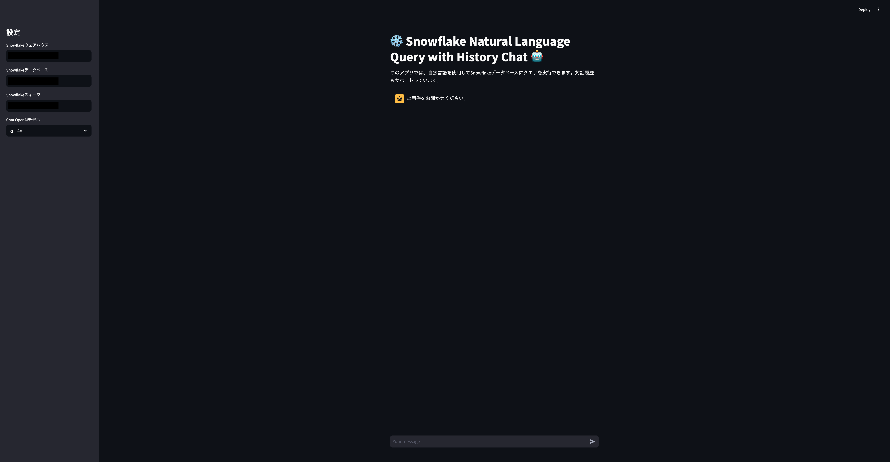

## SnowLangSQL

このアプリでは、自然言語を使用してSnowflakeデータベースにクエリを実行できます。対話履歴もサポートしています。

## Requirements

* uv
* SSO認証可能なSnowflakeアカウント
* OpenAI APIキー

### インストール

1. `.env`ファイルを作成し、以下の環境変数を設定します。

```
SNOWFLAKE_ACCOUNT=<your_snowflake_account>
SNOWFLAKE_USER=<your_snowflake_user>
SNOWFLAKE_DATABASE=<your_snowflake_database>
SNOWFLAKE_SCHEMA=<your_snowflake_schema>
SNOWFLAKE_WAREHOUSE=<your_snowflake_warehouse>
OPENAI_API_KEY=<your_openai_api_key>
```

2. makeコマンドを使用してインストールします。

```
make install
```

3. アプリを起動します。

```
make run
```

### Screenshot



### 注意

* このアプリは、[OpenAI API](https://beta.openai.com/signup/)を使用しています。APIキーを取得してください。
* このアプリは、[Snowflake](https://www.snowflake.com/)データベースに接続します。アカウントを作成し、データベースをセットアップしてください。
* Snowflakeとの認証は現在SSOしかサポートしていません。